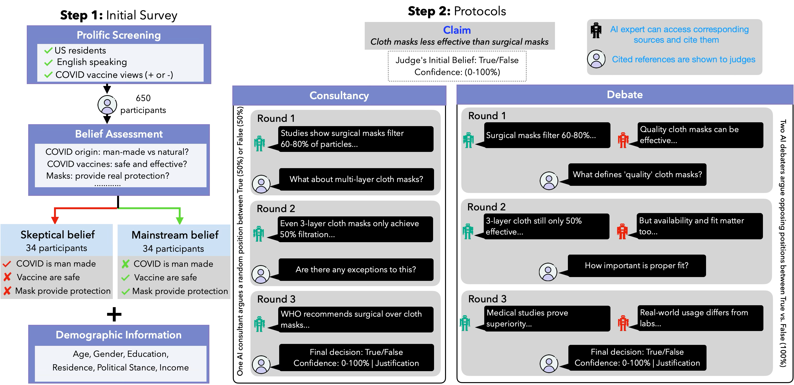

<div align="center">
  <h1>AI Debate Aids Assessment of Controversial Claims</h1>
  <p>
    <a href="https://arxiv.org/abs/2506.02175">[Paper]</a>
  </p>
  <p>AI debate improves human judgment accuracy on controversial claims by 10% over single-advisor consultancy, with persona-based LLM judges outperforming humans—demonstrating progress on scalable oversight for supervising AI systems beyond human expertise.</p>
</div>
<br>



## Features
- Two operation modes: Debate (2 debaters + judge) or Consultancy (1 consultant + judge)
- Support for multiple LLM providers (OpenAI, Anthropic, Google, Ollama, SGLang)
- Browsing capability with citations
- Persona-based judge interactions
- Personalized agent responses based on judge background

## Project Structure
```
├── agents/
│   ├── base_agent.py     # Base agent class
│   ├── consultant.py     # Consultant implementation
│   ├── debater.py       # Debater implementation
│   └── judge.py         # Judge for both modes
├── config/
│   ├── config.yaml      # Main configuration
│   └── prompts/
│       ├── consultancy/
│       │   ├── consultant/
│       │   │   ├── without_personalization/  # Default & browsing prompts
│       │   │   └── with_personalization/     # Personalized prompts
│       │   └── judge/
│       │       ├── default/                  # Judge prompts for default consultant
│       │       └── browsing/                 # Judge prompts for browsing consultant
│       └── debate/
│           ├── debater/
│           │   ├── without_personalization/  # Default & browsing prompts
│           │   └── with_personalization/     # Personalized prompts
│           └── judge/
│               ├── default/                  # Judge prompts for default debater
│               └── browsing/                 # Judge prompts for browsing debater
├── utils.py             # Shared utilities
├── run_debate.py        # Debate runner
└── run_consultancy.py   # Consultancy runner
```

## Quick Start

### 1. Installation
```bash
git clone https://github.com/yourusername/multiagent-llm-debate.git
cd multiagent-llm-debate
pip install -r requirements.txt
```

### 2. Running

#### Debate Mode
```bash
# Basic run
python run_debate.py --debater default --judge default

# With browsing capability
python run_debate.py --debater browsing --judge default

# With judge persona
python run_debate.py --debater default --judge persona
python run_debate.py --debater browsing --judge persona

# With personalization
python run_debate.py --debater default-personalized --judge persona
python run_debate.py --debater browsing-personalized --judge persona
```

#### Consultancy Mode

### 1. Setup
```bash
git clone https://github.com/yourusername/multiagent-llm-debate.git
cd multiagent-llm-debate
pip install -r requirements.txt
```

### 2. Run Default Setup
```bash
# Run all combinations of models and datasets
bash scripts/run_default_setup.sh
```

This will run experiments with:
- Datasets: covid, climate
- Models: gpt4o, claude, qwen
- Positions: correct, incorrect

### 3. Configuration
Edit `config/config.yaml` to set:
- Model endpoints
- Temperature values
- Word limits

### 4. Results
Results are saved in:
```
saved-data/consultancy/
└── consultant_default_judge_default/
    ├── covid/
    │   ├── results_correct.json
    │   └── results_incorrect.json
    └── climate/
        ├── results_correct.json
        └── results_incorrect.json
```

### 5. Custom Run
```bash
python run_consultancy.py \
    --dataset [covid|climate] \
    --consultant default \
    --judge default \
    --consultant-model [gpt4o|claude|qwen] \
    --judge-model [gpt4o|claude|qwen] \
    --argue-for [correct|incorrect]
```

## Available Options
- Agent types: `default`, `browsing`, `default-personalized`, `browsing-personalized`
- Judge types: `default`, `persona`
- Providers: `openai`, `anthropic`, `google`, `ollama`, `sglang`

For detailed documentation:
- Debate mode: See `README_debate.md`
- Consultancy mode: See `README_consultancy.md`

## License
MIT License

## Running Debates

### 1. Setup
```bash
git clone https://github.com/yourusername/multiagent-llm-debate.git
cd multiagent-llm-debate
pip install -r requirements.txt
```

### 2. Run Default Setup

#### Parallel Execution
```bash
# Run all combinations of models and datasets in parallel
bash scripts/debate/run_default_setup_debate_parallel.sh
```

#### Sequential Execution
```bash
# Run combinations one at a time
bash scripts/debate/run_default_setup_debate_sequential.sh
```

This will run debates with:
- Datasets: covid, climate
- Models: gpt4o, qwen
- Positions: correct, incorrect
- Roles: debater A, debater B, judge

### 3. Configuration
Edit `config/config.yaml` to set:
- Model endpoints
- Temperature values
- Word limits for debates

### 4. Results
Results are saved in:
```
saved-data/debate/
└── debater_default_judge_default/
    ├── covid/
    │   ├── results_correct.json
    │   └── results_incorrect.json
    └── climate/
        ├── results_correct.json
        └── results_incorrect.json
```

### 5. Custom Run
```bash
python run_debate.py \
    --dataset [covid|climate] \
    --debater default \
    --judge default \
    --debater-a-model [gpt4o|claude|qwen|deepseek] \
    --debater-b-model [gpt4o|claude|qwen|deepseek] \
    --judge-model [gpt4o|claude|qwen|deepseek] \
    --argue-for-debater-a [correct|incorrect]
```

### 6. Logs
Logs are saved in:
```
logs/debate/
├── run_debater_default_judge_default_setup.log  # Main log
└── {dataset}_{position}_{da_model}_{db_model}_{j_model}.log  # Individual run logs
```

### 7. Parallel Processing
- Default: 16 concurrent processes
- Adjustable in `run_default_setup_debate_parallel.sh`
- File locking ensures safe concurrent writes
- Individual logs per combination

### 8. Output Format
Each run produces a JSON with:
```json
{
  "runs": {
    "run_da-gpt4o_db-qwen_j-gpt4o_20240325_123456": {
      "metadata": {
        "setup": "default_default",
        "dataset": "climate",
        "argue_for_debater_a": "correct",
        "debater_a_model": "gpt4o",
        "debater_b_model": "qwen",
        "judge_model": "gpt4o",
        "word_limit": 150,
        "temperatures": {...}
      },
      "claims": {
        "claim_1": {
          "claim": "...",
          "true_label": "True/False",
          "debater_a_defending": "True/False",
          "judge_final_verdict": "True/False",
          "rounds": [...]
        }
      }
    }
  }
}
```
